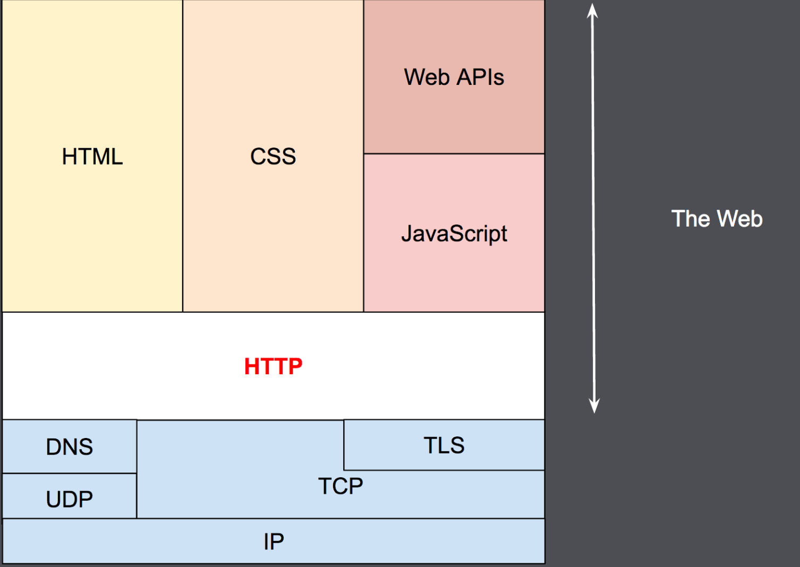

# HTTP(Hypertext Transfer Protocol)

- OSI 계층에서 application-layer(7)
- 전통적인 client-server model을 따름
  - client는 서비스 요청자, server는 서비스 제공자로 구분하여 작업 부하를 분할하는 분산 애플리케이션 모델
- stateless protocol이다. 즉, 서버는 두 요청 사이에 어떠한 상태를 유지하지 않는다.
- client(보통 web-browser)와 server 사이에는 수많은 proxy 엔티티가 존재.



## Client: the user-agent

- user-agent는 user를 대하여 행동을 실행해주는 도구를 말한다.
- web-browser는 요청하고 응답받은 소스들을 결합한다.(hypertext document [html, css, images, sound-files 등..])


## Proxy

- client와 server 사이에서 HTTP 메세지들을 중계한다.
- proxy의 장점
  - caching (private or public, like the browser cache)
  - filtering (virus or parental controls)
  - load balancing (to allow multiple servers to serve different requests)
  - authentication (to control access to different resources)
  - logging (allowing the storage of historical information)
  

## HTTP 특징

- 사람이 읽을 수 있고 간단하게 디자인 됐다. 
- 확장성
- 상태보존을 안하고, 세션이 없다.
- 신뢰성(그러므로 TCP를 사용 / not use UDP)
- HTTP/1.1에서 하나의 TCP 커넥션이 비효율적이라 pipelining을 추가.


## HTTP Flow

1. TCP connection : 하나 이상의 요청을 보내고 응답을 받는 것으로 사용한다.
2. Send HTTP message (아래 예시)  
```
  GET / HTTP/1.1  
  Host: developer.mozilla.org  
  Accept-Language: fr
```
3. Read the response
```
  HTTP/1.1 200 OK
  Date: Sat, 09 Oct 2010 14:28:02 GMT
  Server: Apache
  Last-Modified: Tue, 01 Dec 2009 20:18:22 GMT
  ETag: "51142bc1-7449-479b075b2891b"
  Accept-Ranges: bytes
  Content-Length: 29769
  Content-Type: text/html

  <!DOCTYPE html>… (here come the 29769 bytes of the requested web page)
```
4. Close or Reuse connection : 재사용하는 경우 새로운 커넥션을 요청하지 않아서 빠르다.


## APIs based on HTTP

- 대부분의 흔한 http기반 api는 XMLHttpRequest API를 사용한다.  
  현재는 Fetch API가 같은 특징을 갖고 강하고 유연하게 기능을 제공하고 있다.
- 별개로 서버가 클라이언트에 API 이벤트를 보내는 경우(단방향 서비스) SSE라고도 부른다.  
  EventSource 인터페이스를 사용하여 연결을 열고 이벤트 헨들러를 설정한다.  
  그리고 클라이언트 브라우저는 HTTP 스트림에 도착하는 메세지를 적절한 Event 객체도 자동 변환한다.


---

## reference

- [http](https://developer.mozilla.org/en-US/docs/Web/HTTP)