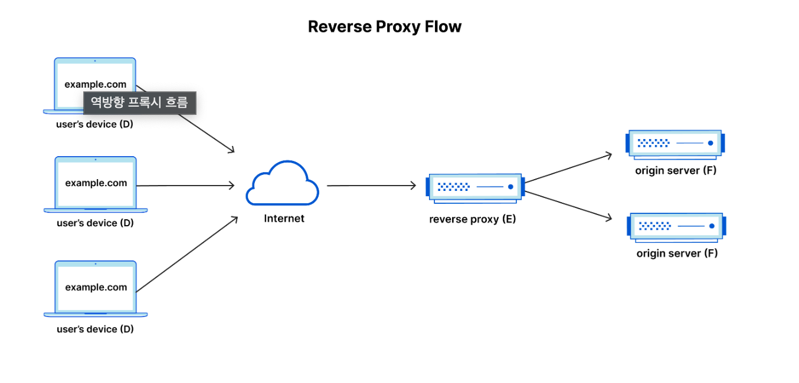

# NginX

- NginX는 웹서버이다. 웹서버라는 것은 클라이언트의 요청에 따라 HTML, CSS, JS 등의 정적인 파일을 제공하는 서버를 말한다.
- NginX는 Apache와 같은 웹서버와 달리 비동기 이벤트 기반 구조로 동작한다.
- NginX는 웹서버의 기능 뿐만 아니라 로드밸런싱, 캐싱, 리버스 프록시 등의 기능도 제공한다.
- 

## WAS와의 차이점

- WAS는 웹서버와 웹 컨테이너의 결합으로 웹서버의 기능을 포함하고 있지만 NginX는 웹서버의 기능만을 가지고 있다.
- WAS는 클라이언트의 요청에 따라 동적인 데이터를 제공하는 서버를 말한다.
- WAS는 데이터베이스 연동, 트랜잭션 관리, 보안, 로깅 등의 기능도 제공한다.


## 리버스 프록시?



```agsl
- 리버스 프록시는 클라이언트와 서버 사이에 위치하여 클라이언트의 요청을 받아 서버에 전달하는 역할을 한다.
- 부하분산: 클라이언트의 요청을 여러 서버에 분산하여 처리할 수 있다.
- 보안: 클라이언트와 서버 사이에 위치하여 서버의 정보를 숨길 수 있다.
- 캐싱: 클라이언트의 요청에 대한 응답을 캐싱하여 서버의 부하를 줄일 수 있다.
- SSL 암호화/복호화: 클라이언트와 서버 사이에 위치하여 SSL 암호화/복호화를 수행할 수 있다.
```

## reference

- [NginX](https://www.nginx.com/)
- [reveerse-proxy](https://www.cloudflare.com/ko-kr/learning/cdn/glossary/reverse-proxy/)
