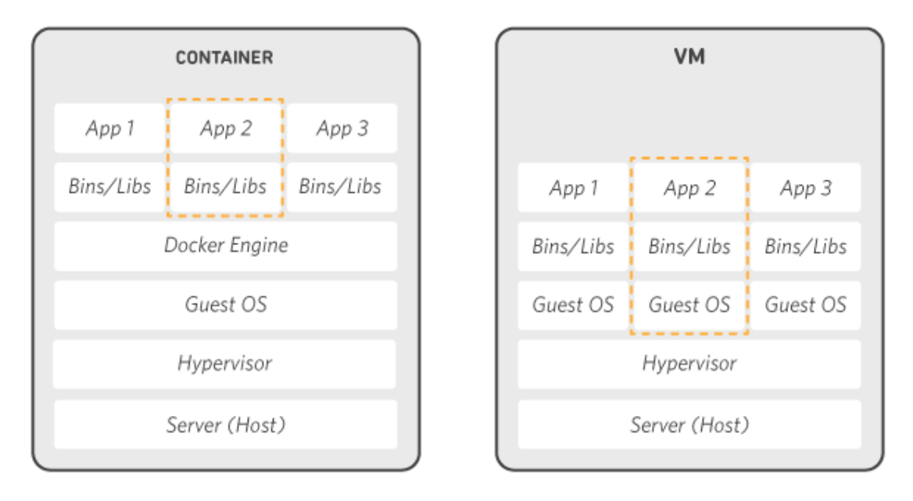

# Docker

- Docker는 애플리케이션을 신속하게 구축, 테스트 및 배포할 수 있는 소프트웨어 플랫폼이다.
- Docker는 소프트웨어를 컨테이너라는 표준화된 유닛으로 패키징하며, 소프트 웨어를 실행하기에 필요한 모든 것을 포함한다. 
- 컨테이너 기반의 가상화 기술을 이용하여 어플리케이션을 더 쉽게 만들고 배포하고 실행할 수 있도록 도와준다.

## Docker 작동방식



- Docker는 컨테이너를 위한 운영 체제이다.
  가상 머신이 서버 하드웨어를 가상화하는 방식과 비슷하게(직접 관리해야 하는 필요성 제거) 컨테이너는 서버 운영 체제를 가상화합니다.<br>
  Docker는 각 서버에 설치되며 컨테이너를 구축, 시작 또는 중단하는 데 사용할 수 있는 간단한 명령을 제공합니다.


## 가상 컴퓨터와 차이점

- 가상 컴퓨터는 한 물리적 컴퓨터 안에 각각 OS를 가동하는 가상 컴퓨터들이 물리적 자원을 분리해서 사용한다.</br>
  그래서 성능에 한계가 생길 수 있다. 
- 반면에 도커는 호스트 OS위에 도커 엔진이라는 프로그램을 통해 컨테이너를 생성하여 사용한다.(실행 환경만 독립적)</br>


# Docker 사용해보기

## 1. Docker 로그인
```agsl
// Docker login
$ docker login

- 로그인 중 Error saving credentials: error storing credentials - err: exit status 1, out: `user boosterko is not authorized to access userid@gmail.com
위와 같은 오류가 발생한 경우에는 
  - cd ~/.docker
  - vi config.json
    - "credsStore": "desktop" 를 "credsStore": "osxkeychain" 로 변경 후 저장
  - docker login 을 다시 실행한다. 
```


## dockerfile 작성
```agsl 
//dockerfile
# JAVA 18 image
FROM openjdk:18
 
 
# OPEN PORT 8080
EXPOSE 8080
```


## docker image build
```agsl
$ docker build -t username/이미지명:태그명 경로

$ docker push username/이미지명:태그명
```


## docker-compose
```agsl
//docker-compose 설치 최신버전은 최신 버전 번호로 수정
- sudo curl -L "https://github.com/docker/compose/releases/download/1.29.2/docker-compose-$(uname -s)-$(uname -m)" -o /usr/local/bin/docker-compose

//실행 권한 부여
sudo chmod +x /usr/local/bin/docker-compose

//심볼릭 링크 생성
sudo ln -s /usr/local/bin/docker-compose /usr/bin/docker-compose

//CentOS, Amazon linux2는 아래 명령어
sudo dnf install libxcrypt-compat
//Ubuntu, Debian
sudo apt-get update
sudo apt-get install libcrypt1
```


## docker logs
```agsl
$ docker logs [컨테이너 ID]
```

## Reference Documentation And Sites

- [AWS Docker](https://aws.amazon.com/ko/docker/)
